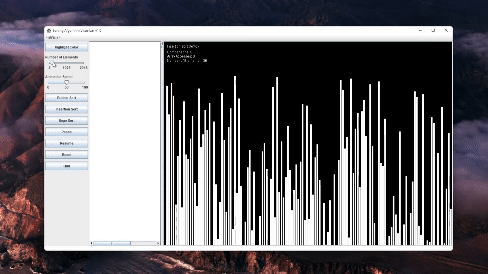

# Sorting Algorithm Visualizer



<div align="center">
  
</div>

The Sorting Algorithm Visualizer is a Java-based program that provides a graphical user interface (GUI) for visualizing various sorting algorithms in real-time. Users can interact with the visualizer to observe the sorting process, customize parameters, and control the sorting animations.

## Table of Contents

- [Overview](#overview)
- [Supported Sorting Algorithms](#supported-sorting-algorithms)
- [Architecture](#architecture)
- [Getting Started](#getting-started)
- [User Interface](#user-interface)
- [Customization](#customization)
- [Contributing](#contributing)
- [License](#license)

## Overview

### Purpose
The Sorting Algorithm Visualizer is designed to help users understand and visualize how different sorting algorithms work in practice. It provides real-time feedback on the sorting process, including comparisons, array accesses, and a visual representation of the array being sorted.

### Key Features
- Visualization of sorting algorithms including Bubble Sort, Insertion Sort, and Bogo Sort.
- Customizable highlight colors for sorting elements.
- Adjustable number of elements in the array.
- Control over the animation speed.
- Pause, resume, reset, and quit options.
- Real-time display of algorithm-related metrics.

## Supported Sorting Algorithms

The Visualizer supports the following sorting algorithms:
- Bubble Sort
- Insertion Sort
- Bogo Sort

## Architecture

### Main Components
- **Visualizer Class**: The main class responsible for initializing the GUI, handling user interactions, and managing the overall flow of the program.
- **Controller Class**: Manages the state of the sorting process, including the array to be sorted, highlighted elements, and flags for controlling sorting.
- **Sort Interface**: Defines a contract for sorting algorithms, including methods for sorting logic and optional methods for algorithm details.
- **Sorting Algorithm Implementations**: Concrete classes implementing the `Sort` interface, each providing the logic for a specific sorting algorithm.

### Threading
- The program uses multi-threading to ensure smooth graphical rendering and user interaction.
- A dedicated UI thread continuously updates the visualization, while sorting algorithms run on separate threads.
- This approach allows for interaction with the UI during sorting.

## Getting Started

To run the Sorting Algorithm Visualizer on your machine, follow these steps:

1. **Prerequisites**: Ensure you have Java installed on your computer.

2. **Clone the Repository**: Clone this GitHub repository to your local machine.

    ```bash
    git clone https://github.com/your-username/visualizer.git
    ```

3. **Compile and Run**: Navigate to the project directory and compile the code using your preferred Java compiler. Run the `Visualizer` class to start the program.

    ```bash
    javac Visualizer.java
    java Visualizer
    ```

4. **Use the GUI**: Once the program is running, use the graphical user interface to select a sorting algorithm, customize settings, and control the animation.

## User Interface

The user interface of the Sorting Algorithm Visualizer consists of the following elements:

- **Highlight Color**: Customize the color used to highlight sorting elements.

- **Number of Elements**: Adjust the number of elements in the array to be sorted.

- **Animation Speed**: Control the speed of the sorting animation.

- **Sorting Buttons**: Choose a sorting algorithm (Bubble Sort, Insertion Sort, or Bogo Sort) and start the sorting process.

- **Utilities**: Use the buttons to pause, resume, reset, or quit the sorting process.

- **Visualization Canvas**: The main area where the sorting process is visually represented.

## Customization

- You can customize the highlight color for sorting elements by clicking the "Highlight Color" button.

- Adjust the number of elements in the array using the "Number of Elements" slider.

- Control the animation speed with the "Animation Speed" slider.

## Contributing

Contributions to the Sorting Algorithm Visualizer project are welcome! If you would like to contribute, please follow the guidelines outlined in the [CONTRIBUTING.md](CONTRIBUTING.md) file.

## License

This program is open-source and available under the [MIT License](LICENSE). Feel free to use and modify it for your educational or personal projects.
